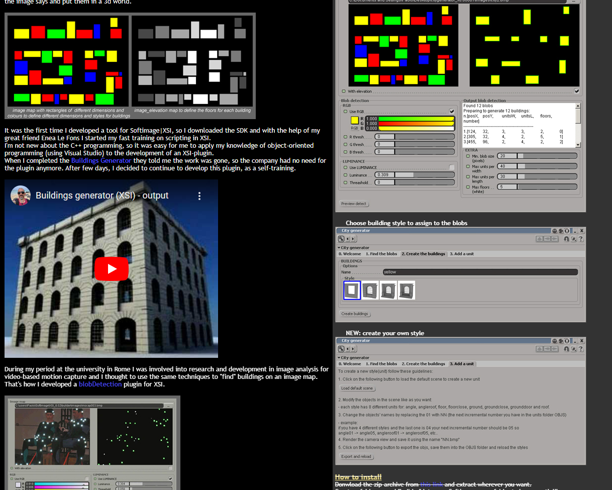
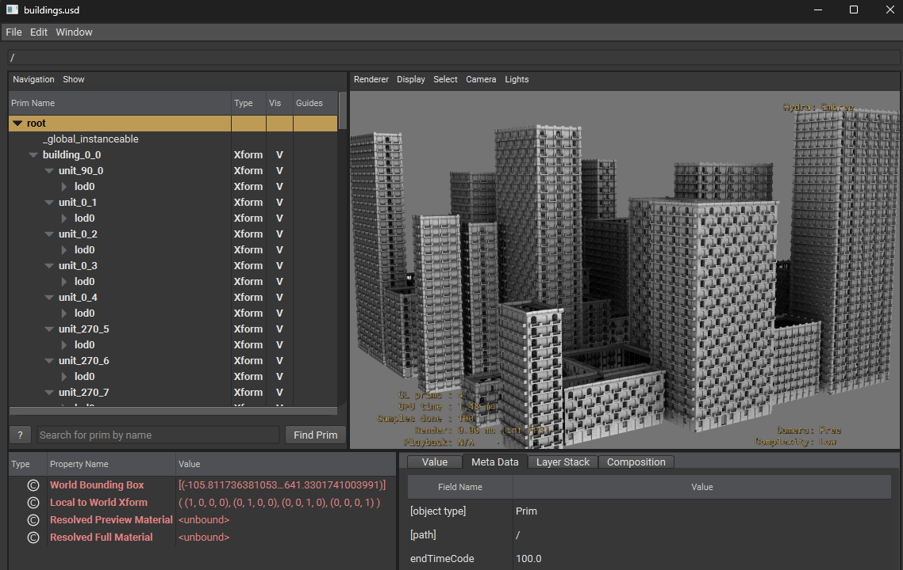

buildingsgenerator
==================

A simple implementation in python of a CityGenerator plugin for XSI I've built many years ago.

https://www.youtube.com/watch?v=isO_fH57lSg

The idea is to model individual cells of various styles of buildings and with a rule-based approach, distribute these cells to make buildings.

This implementation is a simplified version of the plugin but good for testing possibly large scenes with lots of instanced pieces of buildings.

When executed, the script will generate a `buildings.usd` which should look like this

This script has a boolean that enables the descriptions of the cells and their LODs for my custom game engine (GameManager) plugin for USD, in case you are curious to see how I'm describing the scene to then apply auto-switching of LODs directly in a SceneIndex plugin in USD.

https://www.youtube.com/watch?v=wp4ktKy-ojc

