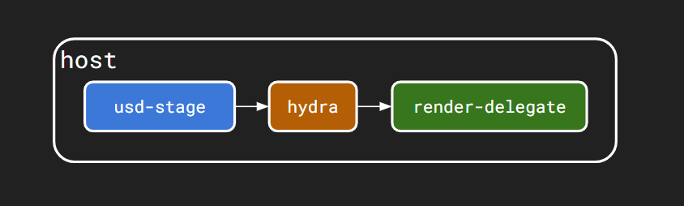
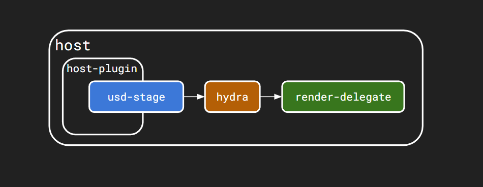
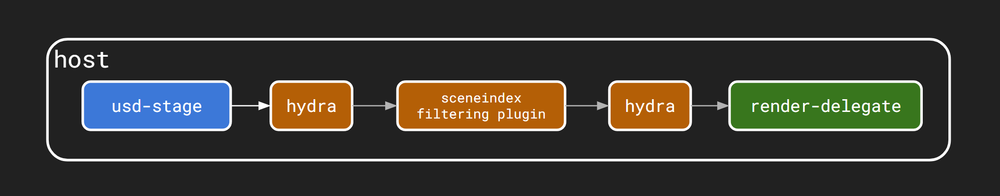

gamemanager
===========

OpenUSD and Hydra provide, together, all you need to describe a scene and send it to a renderer.
But do they provide a way to dynamically evaluate a set of rules or behaviours, like a game-engine would normally do ?
Can we control the main camera with a joystick ? 
Can we open a door if the camera gets close to it ? 
Can we automatically switch to a different LOD ? 
Can we add physics to specific elements of the scene ?
Can we do all of the above only in OpenUSD and Hydra, so that we can just open a USD file in any host/dcc that is USD/Hydra compliant, with all the behaviours described on each usd-primitive, and evaluate them, no matter where we are running it ?

I've been working on USD plugins, and Hydra (1.0) plugins for quite sometime now, and I'm pretty familiar with what's possible.
But I haven't really had much to do with the new Hydra 2.0 API, the SceneIndex plugins.

I will copy here some parts of a X/Twitter post I wrote about what you can do customizing Hydra with a SceneIndex plugin.

Assuming you know what OpenUSD is, I will mainly focus on explaining how Hydra works.

This is Hydra 2.0:
https://openusd.org/release/api/_page__hydra__getting__started__guide.html

If a host/DCC has a full implementation of both OpenUSD and Hydra, it means you can describe a 3d scene with OpenUSD and it can be rendered via Hydra.
And this means that as a developer or vendor, you only have to write now a renderer-plugin for Hydra, and your renderer can run in any of the hosts/DCCs that are compliant with USD and Hydra.

To move a camera or apply some dynamics to a usd-prim, there is usually an interaction between the host-API and openusd-API, and a host-specific plugin that someone wrote, to manipulate usd-prims.

But what if all the edits are happening between OpenUSD and Hydra, without any sort of interaction with the host ?
That means that you could take the same scene, and open it in various hosts/DCCs and still edit primitives in a similar way.

Should I edit usd-prims or hydra-prims ?
----------------------------------------

One of the very first things I wanted to do was to move the main/active camera with a joystick.

And the very first question I had for myself was: where do make the edits ?

I needed a central place to start reading the joystick via GLFW library, and it couldn't have been a custom usd-prim, as you'd normally do with a usd-procedural/plugin.

But also I didn't want to make inside the host, to the be able to manipulate the camera-prim, because I wanted to be able to move the camera while in Houdini/Solaris or while in usdview, for example, and with the same plugin/code.

Then I thought I could approach this problem as you'd do in a Game engine: in editor-mode you setup your objects, and to do that you use "the host" for sure, you might describe behaviours, you are basically "authoring the scene".

Then you switch in "game-mode" and all the behaviours are activated/evaluated, dynamics are activated, and you can go around and mess up the scene.

Then you can stop the game-mode, and back in editor-mode, and everything goes back to where it was, as you described it initially.

How could I replicate this ? What if, when you playback the stage, something is triggered and that is the main/central place to run the evaluation of all behaviours ? And where is the best place to ensure that "everything" would go through it, and that you could also "modify" what goes through, before it is rendered and that you can see it on screen ?

This seemed the perfect job for a Hydra SceneIndexFiltering plugin (for those more familiar with Renderman, it seems an RiFilter basically).

A SceneIndexFiltering plugin will basically let you intervene right before the renderers are asking for the primitives converted from the usd-stage.

And all edits done at this level are temporary, meaning that it is a modification of what you see on the screen, instead of being a modification of the usd-data itself.

Which, on the other hand has the cons of not being able to be "saved/serialized" on disk (yet). Only usd-files can be saved out, with opinions/overs/etc, but the Hydra-stage, basically, it's a transient object only valid while rendering.

But this is what I Wanted.

The engine needs to be continuously running
-------------------------------------------

So, first thing first, lets make a SceneIndexFiltering plugin.

This a very simple project that shows how this type of plugin can be done:
https://github.com/paoloemilioselva/usifTest

This plugin lets you check for every prim that's been dirtied in the usd-stage, then converted to hydra-prims and sent to it, as "events" for prims "added", "dirtied" and "removed".

In each of those 3 events you could do something, up until the render-delegate that's going to render the scene is asking for those prims in the "GetPrim" function.

I wanted to control the camera, meaning that I needed to change its position, when the render-delegate was going to ask for it.

But the camera won't be dirtied in the usd-stage, so I needed an engine that would continuously listen to some events and force updates to hydra-prims, even if in the usd-stage nothing is moving.

But how can I ensure that a "game manager" can actually be evaluated on every cycle. And what is really a cycle here ?

I needed a trigger, something to change the scene into "game mode".

I decided to go with "playing the stage", and having a "gamemanager" prim with a frame value, being dirtied on every new frame.

Now I'm the infinite loop of my game-manager.

Moving the camera with a joystick
---------------------------------

https://www.youtube.com/watch?v=g1wBleSrxzY

(to be continued...)