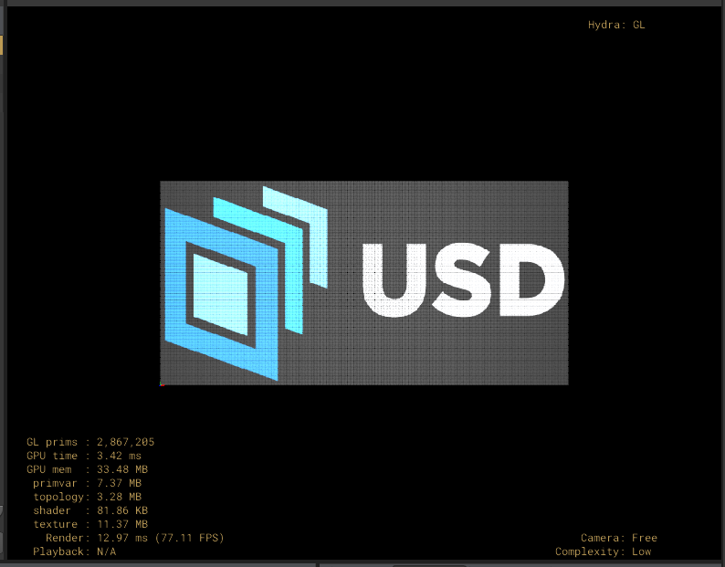
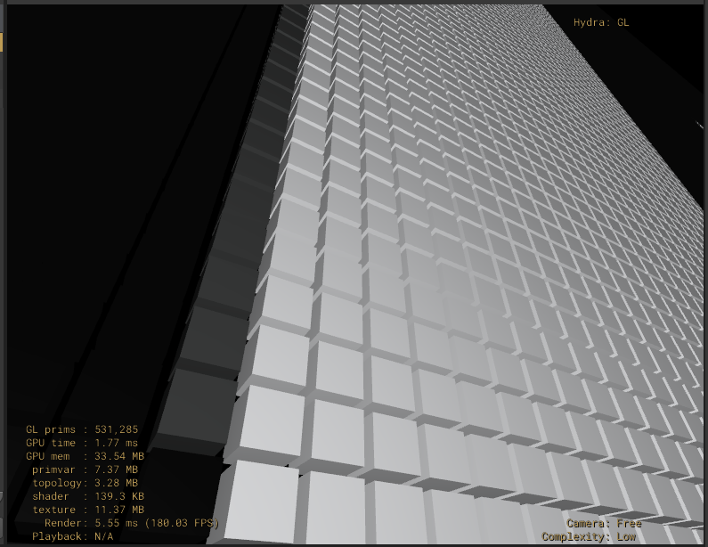
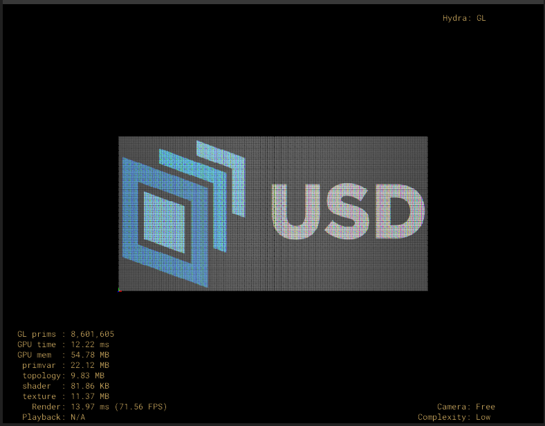
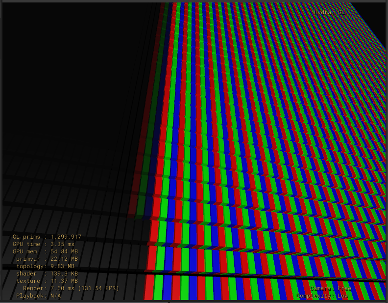

led_screen
==========

Script to generate an LED panel, where each pixel is a cube-instance of a PointInstancer.

There are 2 types of LED-pixels that can be used:

- RGBLED
   - one pixel -> one RGB led -> one instanced cube with a displayColor value
   
   

- RGBLedIPS
   - 3 leds per pixel, RGB as (i)n (p)lane (s)witching, each pixel made of 3 instanced cubes, one per color-channel, with different intensity
   
   

An image is used to define the color or intensity of each cube.

How to run it
-------------

If you have your own OpenUSD environment with OpenImageIO for python, you can launch it with:

`python generate.py`

or you can use Houdini's Command Line Tools and launch it with:

`hython generate.py`

and it will generate a file called `ledpanel.usd`