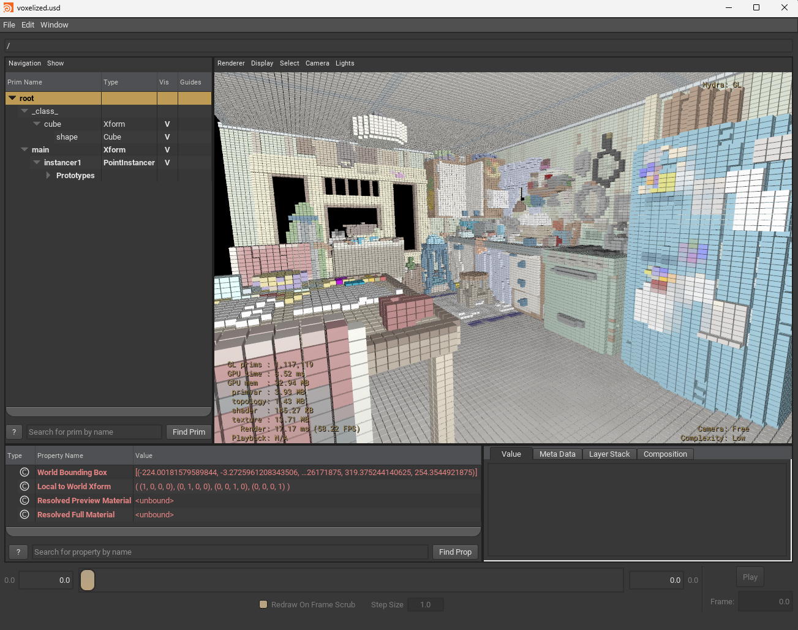

voxelizer
=========

Rough implementation of a DDA in 3D to voxelize n-gons (as triangles-fan).

It generates a single PointInstancer with instanced cubes, with per-instance colors from
the original mesh-colors (if provided).

It leaves a small-gap between cubes for a better visualization.

Here, the Pixar's Kitchen Set voxelized and each cube retained the mesh-color.

Cubes aren't really cubes, as you can see, size is controlled by how many "voxels" are 
asked to be generated, based on scene bounds.

